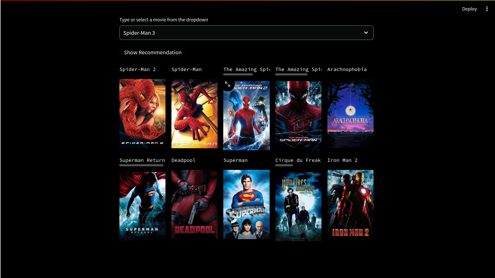
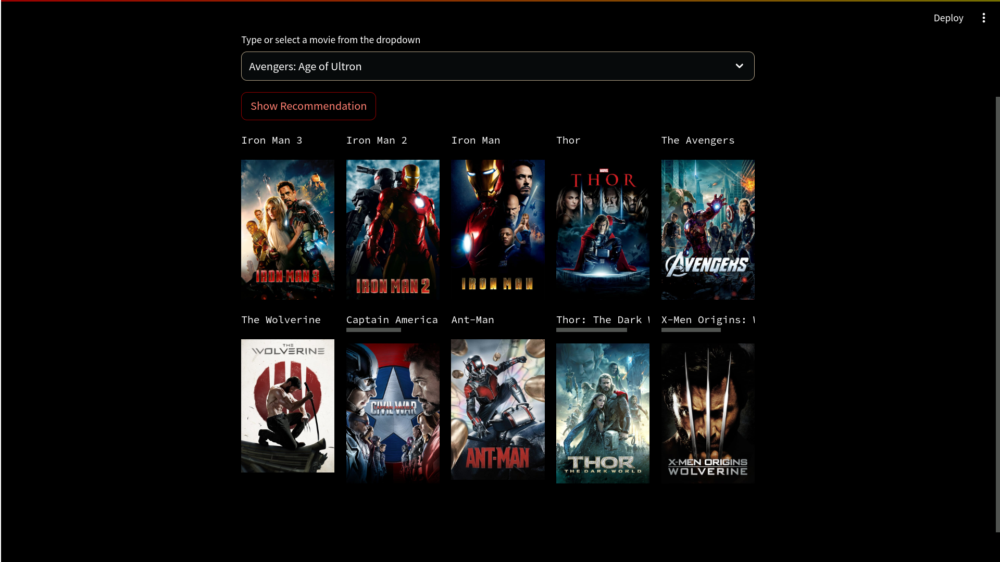

# Movie-Recommender-System

A **movie recommender system** is a type of software application or algorithm designed to provide personalized suggestions or recommendations for movies to users based on their preferences, behavior, or historical data. Recommender systems are widely used in various online platforms to enhance user experience by offering tailored content recommendations. There are several types of movie recommender systems, but two common approaches are collaborative filtering and content-based filtering.

 

## Table of Contents

- [About](#about)
- [Getting Started](#getting-started)
- [Usage](#usage)
- [Output](#output)
- [Contributing](#contributing)
- [License](#license)

## About

This Movie Recommender System is built using Python and Streamlit. It recommends movies based on user input and provides a user-friendly interface for exploring movie suggestions.

## Getting Started

To run the recommender system locally, follow these steps:

1. Clone the repository:

   ```bash
   git clone https://github.com/Ahmad10Raza/Movie-Recommender-System.git
   ```

2. Install the required dependencies:

   ```bash
   pip install -r requirements.txt
   ```
3. Run the Streamlit app:

   ```bash
   streamlit run app.py
   ```

Visit [Streamlit Documentation](https://docs.streamlit.io/) for more details on running Streamlit apps.

## Usage

1. Enter the name of a movie in the input box.
2. Click the "Show Recommendation" button to get personalized movie recommendations.
3. Explore the recommendations displayed on the Streamlit app.

## Output





The output section showcases the recommendations provided by the Movie Recommender System. Each movie is displayed with its name and poster image.

## Contributing

Contributions are welcome! Feel free to open issues or submit pull requests.

## License

This project is licensed under the [MIT License](LICENSE).
